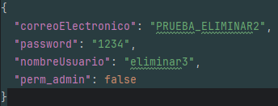
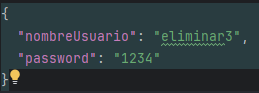
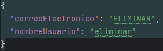
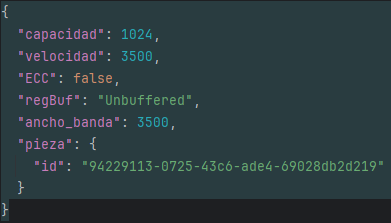
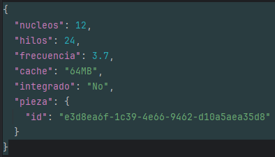
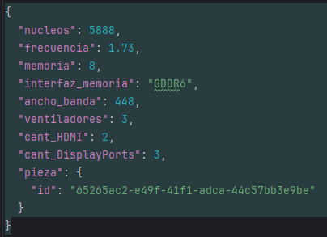
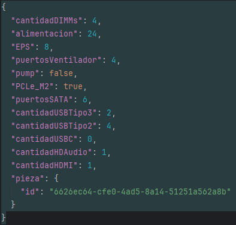
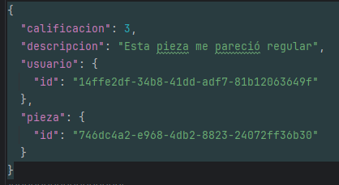
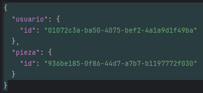

# BACKEND DE TEC MATCH
## Documentación de la API
### Tipos de Sockets
| Método | Ruta                                        | Descipción                                                                               | Body             |
|--------|---------------------------------------------|------------------------------------------------------------------------------------------|------------------|
| POST   | /api/v1/tipos-socket                        | Crea un tipo de socket                                                                   | {nombre:String}  |
| GET    | /api/v1/tipos-socket                        | Obtiene todos los tipos de socket                                                        | ---------------  |
| GET    | /api/v1/tipos-socket/{id}                   | Obtiene un tipo de socket por ID                                                         | ---------------  |
| GET    | /api/v1/tipos-socket/nombre?contains=String | Obtiene tipos de sockets con nombres que contengan el String. (Ignora el case sensitive) | ---------------  |
| PUT    | /api/v1/tipos-socket/{id}                   | Actualiza un tipo de socket existente                                                    | {nombre:String}  |
| DELETE | /api/v1/tipos-socket/{id}                   | Elimina un tipo de socket existente                                                      | ---------------  |
### Sockets
| Método | Ruta                                   | Descipción                                                                      | Body                                   |
|--------|----------------------------------------|---------------------------------------------------------------------------------|----------------------------------------|
| POST   | /api/v1/sockets                        | Crea un socket                                                                  |   |
| GET    | /api/v1/sockets                        | Obtiene todos los socket                                                        | ---------------                        |
| GET    | /api/v1/sockets/{id}                   | Obtiene un socket por ID                                                        | ---------------                        |
| GET    | /api/v1/sockets/nombre?contains=String | Obtiene sockets con nombres que contengan el String. (Ignora el case sensitive) | ---------------                        |
| GET    | /api/v1/sockets/tipo-socket/{id}       | Obtiene sockets con el id de un tipo de socket                                  |                                        |
| PUT    | /api/v1/sockets/{id}                   | Actualiza un socket existente                                                   | {nombre:String}                        |
| DELETE | /api/v1/sockets/{id}                   | Elimina un socket existente                                                     | ---------------                        |
### Fabricantes
| Método | Ruta                                        | Descipción                                                                          | Body             |
|--------|---------------------------------------------|-------------------------------------------------------------------------------------|------------------|
| POST   | /api/v1/tipos-socket                        | Crea un fabricante                                                                  | {nombre:String}  |
| GET    | /api/v1/tipos-socket                        | Obtiene todos los fabricantes                                                       | ---------------  |
| GET    | /api/v1/tipos-socket/{id}                   | Obtiene un fabricante por ID                                                        | ---------------  |
| GET    | /api/v1/tipos-socket/nombre?contains=String | Obtiene fabricantes con nombres que contengan el String. (Ignora el case sensitive) | ---------------  |
| PUT    | /api/v1/tipos-socket/{id}                   | Actualiza un fabricante existente                                                   | {nombre:String}  |
| DELETE | /api/v1/tipos-socket/{id}                   | Elimina un fabricante existente                                                     | ---------------  |
### Piezas
| Método | Ruta                                  | Descipción                                                                     | Body                                  |
|--------|---------------------------------------|--------------------------------------------------------------------------------|---------------------------------------|
| POST   | /api/v1/piezas                        | Crea una piezas                                                                |   |
| GET    | /api/v1/piezas                        | Obtiene todas las piezas                                                       | ---------------                       |
| GET    | /api/v1/piezas/{id}                   | Obtiene una pieza por ID                                                       | ---------------                       |
| GET    | /api/v1/piezas/nombre?contains=String | Obtiene piezas con nombres que contengan el String. (Ignora el case sensitive) | ---------------                       |
| GET    | /api/v1/piezas/modelo?contains=String | Obtiene piezas con modelos que contengan el String. (Ignora el case sensitive) | ---------------                       |
| GET    | /api/v1/piezas/precio?lessThan=Float  | Obtiene piezas cuyo precio sean menores al Float                               | ---------------                       |
| GET    | /api/v1/piezas/voltaje?voltaje=Float  | Obtiene piezas cuyo voltaje sean iguales al Float                              | ---------------                       |
| GET    | /api/v1/piezas/socket/{id}            | Obtiene piezas con el id de su socket                                          | ---------------                       |
| GET    | /api/v1/piezas/fabricante/{id}        | Obtiene piezas con el id de su fabricante                                      | ---------------                       |
| PUT    | /api/v1/piezas/{id}                   | Actualiza una pieza existente                                                  |    |
| DELETE | /api/v1/piezas/{id}                   | Elimina una pieza existente                                                    | ---------------                       |
### Usuarios
| Método | Ruta                   | Descipción                                  | Body                                    |
|--------|------------------------|---------------------------------------------|-----------------------------------------|
| POST   | /api/v1/usuarios       | Crea un usuario                             |   |
| POST   | /api/v1/usuarios/login | Logea a un usuario verificando credenciales |  |
| GET    | /api/v1/usuarios       | Obtiene todos los usuarios                  | ---------------                         |
| GET    | /api/v1/usuarios/{id}  | Obtiene un usuario por ID                   | ---------------                         |
| PUT    | /api/v1/usuarios/{id}  | Actualiza un usuario existente              |    |
| DELETE | /api/v1/usuarios/{id}  | Elimina un usuario existente                | ---------------                         |
**¡CONSIDERACIÓN IMPORTANTE!: Por ahora al usuario solo se le puede actualizar el correo y el nombre de usuario**
### RAMs
| Método | Ruta                   | Descipción                            | Body                                         |
|--------|------------------------|---------------------------------------|----------------------------------------------|
| POST   | /api/v1/RAM            | Crea una RAM                          |            |
| GET    | /api/v1/RAM            | Obtiene todas las RAMS                | ---------------                              |
| GET    | /api/v1/RAM/{id}       | Obtiene una RAM por ID                | ---------------                              |
| GET    | /api/v1/RAM/pieza/{id} | Obtiene una RAM por el ID de la Pieza | ---------------                              |
| PUT    | /api/v1/RAM/{id}       | Actualiza una RAM existente           | Igual que el body del POST pero sin "pieza"  |
| DELETE | /api/v1/RAM/{id}       | Elimina una RAM existente             | ---------------                              |
### Procesadores
| Método | Ruta                          | Descipción                                  | Body                                         |
|--------|-------------------------------|---------------------------------------------|----------------------------------------------|
| POST   | /api/v1/PROCESADOR            | Crea un procesador                          |     |
| GET    | /api/v1/PROCESADOR            | Obtiene todos los procesadores              | ---------------                              |
| GET    | /api/v1/PROCESADOR/{id}       | Obtiene un procesador por ID                | ---------------                              |
| GET    | /api/v1/PROCESADOR/pieza/{id} | Obtiene un procesador por el ID de la Pieza | ---------------                              |
| PUT    | /api/v1/PROCESADOR/{id}       | Actualiza un procesador existente           | Igual que el body del POST pero sin "pieza"  |
| DELETE | /api/v1/PROCESADOR/{id}       | Elimina un procesador existente             | ---------------                              |
### Gráficas
| Método | Ruta                       | Descipción                                | Body                                         |
|--------|----------------------------|-------------------------------------------|----------------------------------------------|
| POST   | /api/v1/GRAFICA            | Crea una gráfica                          |      |
| GET    | /api/v1/GRAFICA            | Obtiene todas las gráficas                | ---------------                              |
| GET    | /api/v1/GRAFICA/{id}       | Obtiene una gráfica por ID                | ---------------                              |
| GET    | /api/v1/GRAFICA/pieza/{id} | Obtiene una gráfica por el ID de la Pieza | ---------------                              |
| PUT    | /api/v1/GRAFICA/{id}       | Actualiza una gráfica existente           | Igual que el body del POST pero sin "pieza"  |
| DELETE | /api/v1/GRAFICA/{id}       | Elimina una gráfica existente             | ---------------                              |
### Placas
| Método | Ruta                     | Descipción                              | Body                                         |
|--------|--------------------------|-----------------------------------------|----------------------------------------------|
| POST   | /api/v1/PLACA            | Crea una placa                          |        |
| GET    | /api/v1/PLACA            | Obtiene todas las placas                | ---------------                              |
| GET    | /api/v1/PLACA/{id}       | Obtiene una placa por ID                | ---------------                              |
| GET    | /api/v1/PLACA/pieza/{id} | Obtiene una placa por el ID de la Pieza | ---------------                              |
| PUT    | /api/v1/PLACA/{id}       | Actualiza una placa existente           | Igual que el body del POST pero sin "pieza"  |
| DELETE | /api/v1/PLACA/{id}       | Elimina una placa existente             | ---------------                              |
### Reseñas
| Método | Ruta                                             | Descipción                                               | Body                                                      |
|--------|--------------------------------------------------|----------------------------------------------------------|-----------------------------------------------------------|
| POST   | /api/v1/reviews                                  | Crea una reseña                                          |                      |
| GET    | /api/v1/reviews                                  | Obtiene todas las reseñas                                | ---------------                                           |
| GET    | /api/v1/reviews/{id}                             | Obtiene una reseña por ID                                | ---------------                                           |
| GET    | /api/v1/reviews/pieza/{id}                       | Obtiene reseñas por el ID de la Pieza                    | ---------------                                           |
| GET    | /api/v1/reviews/pieza/{id}/calificacion-promedio | Obtiene calificacion promedio de las reviews de la pieza | ---------------                                           |
| PUT    | /api/v1/reviews/{id}                             | Actualiza una reseña existente                           | Igual que el body del POST pero sin "pieza" ni "usuario"  |
| DELETE | /api/v1/reviews/{id}                             | Elimina una reseña existente                             | ---------------                                           |
### Pieza en lista de deseos
| Método | Ruta                                 | Descipción                                            | Body                         |
|--------|--------------------------------------|-------------------------------------------------------|------------------------------|
| POST   | /api/v1/piezas-deseadas              | Agrega una pieza a la lista de deseos                 |    |
| GET    | /api/v1/piezas-deseadas/usuario/{id} | Obtiene las piezas deseadas de un usuario en concreto | ---------------              |
| DELETE | /api/v1/piezas-deseadas/{id}         | Elimina una pieza de la lista de deseos               | ---------------              |
### Pieza en lista de deseos
| Método | Ruta                                              | Descipción                                                            | Body                           |
|--------|---------------------------------------------------|-----------------------------------------------------------------------|--------------------------------|
| POST   | /api/v1/piezas-en-lista-contruccion               | Agrega una pieza a la lista de construcción                           |      |
| GET    | /api/v1/piezas-en-lista-construccion/usuario/{id} | Obtiene las piezas en lista de construcción de un usuario en concreto | ---------------                |
| DELETE | /api/v1/piezas-en-lista-construccion/{id}         | Elimina una pieza de la lista de construcción                         | ---------------                |
