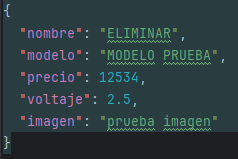

# BACKEND DE TEC MATCH
## Documentación de la API
### Tipos de Sockets
| Método | Ruta                                        | Descipción                                                                               | Body             |
|--------|---------------------------------------------|------------------------------------------------------------------------------------------|------------------|
| POST   | /api/v1/tipos-socket                        | Crea un tipo de socket                                                                   | {nombre:String}  |
| GET    | /api/v1/tipos-socket                        | Obtiene todos los tipos de socket                                                        | ---------------  |
| GET    | /api/v1/tipos-socket/{id}                   | Obtiene un tipo de socket por ID                                                         | ---------------  |
| GET    | /api/v1/tipos-socket/nombre?contains=String | Obtiene tipos de sockets con nombres que contengan el String. (Ignora el case sensitive) | ---------------  |
| PUT    | /api/v1/tipos-socket/{id}                   | Actualiza un tipo de socket existente                                                    | {nombre:String}  |
| DELETE | /api/v1/tipos-socket/{id}                   | Elimina un tipo de socket existente                                                      | ---------------  |
### Sockets
| Método | Ruta                                   | Descipción                                                                      | Body                                   |
|--------|----------------------------------------|---------------------------------------------------------------------------------|----------------------------------------|
| POST   | /api/v1/sockets                        | Crea un socket                                                                  |   |
| GET    | /api/v1/sockets                        | Obtiene todos los socket                                                        | ---------------                        |
| GET    | /api/v1/sockets/{id}                   | Obtiene un socket por ID                                                        | ---------------                        |
| GET    | /api/v1/sockets/nombre?contains=String | Obtiene sockets con nombres que contengan el String. (Ignora el case sensitive) | ---------------                        |
| GET    | /api/v1/sockets/tipo-socket/{id}       | Obtiene sockets con el id de un tipo de socket                                  |                                        |
| PUT    | /api/v1/sockets/{id}                   | Actualiza un socket existente                                                   | {nombre:String}                        |
| DELETE | /api/v1/sockets/{id}                   | Elimina un socket existente                                                     | ---------------                        |
### Fabricantes
| Método | Ruta                                        | Descipción                                                                          | Body             |
|--------|---------------------------------------------|-------------------------------------------------------------------------------------|------------------|
| POST   | /api/v1/tipos-socket                        | Crea un fabricante                                                                  | {nombre:String}  |
| GET    | /api/v1/tipos-socket                        | Obtiene todos los fabricantes                                                       | ---------------  |
| GET    | /api/v1/tipos-socket/{id}                   | Obtiene un fabricante por ID                                                        | ---------------  |
| GET    | /api/v1/tipos-socket/nombre?contains=String | Obtiene fabricantes con nombres que contengan el String. (Ignora el case sensitive) | ---------------  |
| PUT    | /api/v1/tipos-socket/{id}                   | Actualiza un fabricante existente                                                   | {nombre:String}  |
| DELETE | /api/v1/tipos-socket/{id}                   | Elimina un fabricante existente                                                     | ---------------  |
### Piezas
| Método | Ruta                                  | Descipción                                                                     | Body                                  |
|--------|---------------------------------------|--------------------------------------------------------------------------------|---------------------------------------|
| POST   | /api/v1/piezas                        | Crea una piezas                                                                |   |
| GET    | /api/v1/piezas                        | Obtiene todas las piezas                                                       | ---------------                       |
| GET    | /api/v1/piezas/{id}                   | Obtiene una pieza por ID                                                       | ---------------                       |
| GET    | /api/v1/piezas/nombre?contains=String | Obtiene piezas con nombres que contengan el String. (Ignora el case sensitive) | ---------------                       |
| GET    | /api/v1/piezas/modelo?contains=String | Obtiene piezas con modelos que contengan el String. (Ignora el case sensitive) | ---------------                       |
| GET    | /api/v1/piezas/precio?lessThan=Float  | Obtiene piezas cuyo precio sean menores al Float                               | ---------------                       |
| GET    | /api/v1/piezas/voltaje?voltaje=Float  | Obtiene piezas cuyo voltaje sean iguales al Float                              | ---------------                       |
| GET    | /api/v1/piezas/socket/{id}            | Obtiene piezas con el id de su socket                                          | ---------------                       |
| GET    | /api/v1/piezas/fabricante/{id}        | Obtiene piezas con el id de su fabricante                                      | ---------------                       |
| PUT    | /api/v1/piezas/{id}                   | Actualiza una pieza existente                                                  |    |
| DELETE | /api/v1/piezas/{id}                   | Elimina una pieza existente                                                    | ---------------                       |
